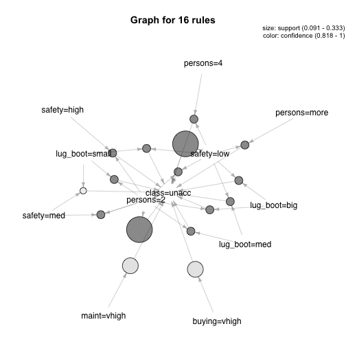
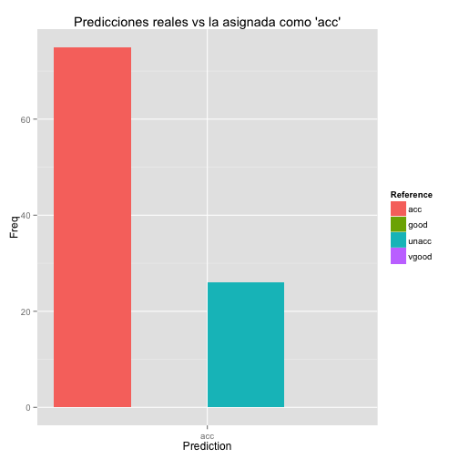
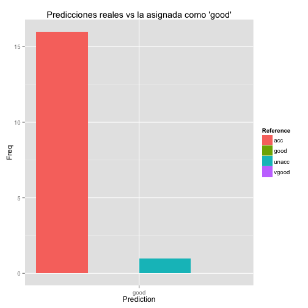
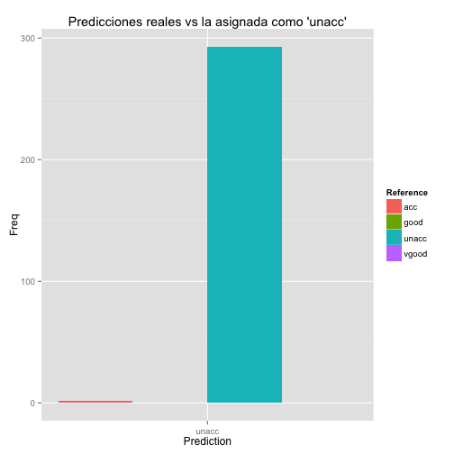
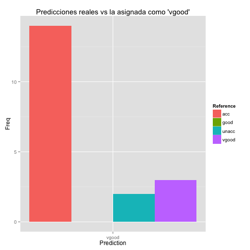

Car Evaluation 2018
========================================================

# Introduccion

Trabajo para el curso de Ciencia Abierta del programa de Doctorado de la UGR.
El dataset utilizado para este trabajo es "Car Evaluation Data Set", de Bohanec M. y Zupan B. [UCI Machine Learning Repository](https://archive.ics.uci.edu/ml/datasets/car+evaluation). Este dataset esta formado por 6 variables, ademas de la variable de clase que indica si el coche es aceptable o no.

Las variables son las siguientes:

- **buying**: Precio del coche. Valores: vhigh, high, med, low.
- **maint**: Precio de mantenimiento. Valores: vhigh, high, med, low.
- **doors**: Numero de puertas. Valores: 2, 3, 4, 5more.
- **persons**: Numero de pasajeros. Valores: 2, 4, more.
- **lug_boot**: Tamaño del maletero. Valores: small, med, big.
- **safety**: Seguridad del coche. Valores: high, med, low.


# Reglas de Asociacion

Se han aplicado reglas de asociacion con el objetivo de detectar asociaciones entre las diferentes variables del dataset, de forma que podamos comprender mejor dicho dataset y que variables son mas interesantes de cara a clasificar y evaluar los coches.

En primer lugar aplicamos el algoritmo [Apriori](https://www.it.uu.se/edu/course/homepage/infoutv/ht08/vldb94_rj.pdf), con un soporte minimo de 0.09 y una confianza de 0.8.


```r
###################APLICAMOS REGLAS DE ASOCIACION############################
# Aplica Apriori
rules <- apriori(car_data, parameter = list(minlen=2, supp=0.09, conf=0.8), control = list(verbose=F))
length(rules)
```

```
## [1] 16
```

```r
rules.sorted <- sort(rules, by="support")
inspect(rules.sorted)
```

```
##    lhs                            rhs           support    confidence
## 3  {safety=low}                => {class=unacc} 0.33333333 1.0000000 
## 4  {persons=2}                 => {class=unacc} 0.33333333 1.0000000 
## 1  {buying=vhigh}              => {class=unacc} 0.20833333 0.8333333 
## 2  {maint=vhigh}               => {class=unacc} 0.20833333 0.8333333 
## 5  {lug_boot=big,safety=low}   => {class=unacc} 0.11111111 1.0000000 
## 6  {persons=2,lug_boot=big}    => {class=unacc} 0.11111111 1.0000000 
## 7  {persons=4,safety=low}      => {class=unacc} 0.11111111 1.0000000 
## 8  {persons=more,safety=low}   => {class=unacc} 0.11111111 1.0000000 
## 9  {lug_boot=med,safety=low}   => {class=unacc} 0.11111111 1.0000000 
## 10 {persons=2,lug_boot=med}    => {class=unacc} 0.11111111 1.0000000 
## 11 {persons=2,safety=high}     => {class=unacc} 0.11111111 1.0000000 
## 13 {persons=2,safety=med}      => {class=unacc} 0.11111111 1.0000000 
## 14 {lug_boot=small,safety=low} => {class=unacc} 0.11111111 1.0000000 
## 15 {persons=2,safety=low}      => {class=unacc} 0.11111111 1.0000000 
## 16 {persons=2,lug_boot=small}  => {class=unacc} 0.11111111 1.0000000 
## 12 {lug_boot=small,safety=med} => {class=unacc} 0.09085648 0.8177083 
##    lift    
## 3  1.428099
## 4  1.428099
## 1  1.190083
## 2  1.190083
## 5  1.428099
## 6  1.428099
## 7  1.428099
## 8  1.428099
## 9  1.428099
## 10 1.428099
## 11 1.428099
## 13 1.428099
## 14 1.428099
## 15 1.428099
## 16 1.428099
## 12 1.167769
```

Como podemos ver, obtenemos un conjunto de 16 reglas. Ordenadas por la medida de soporte, las dos primeras reglas nos proporcionan gran informacion, puesto que nos indican que en un 33% (soporte=0.33) de los casos de nuestro dataset la compra de dicho coche sera inaceptable en caso de que la seguridad proporcionada por este sea baja o el numero de pasajeros sea 2 (es el minimo). Esto nos indica que, en general, segun nuestro dataset aquello coches que cumplan alguna o ambas de estas reglas seran, probablemente, inaceptables.

Ademas, tambien hemos obtenido las siguientes reglas:

- [11] {persons=2,safety=high}     => {class=unacc} 0.11111111 1.0000000  1.428099 192  
- [12] {persons=2,safety=med}      => {class=unacc} 0.11111111 1.0000000  1.428099 192
- [14] {persons=2,safety=low}      => {class=unacc} 0.11111111 1.0000000  1.428099 192

Que nos indican que, si el numero de pasajeros es 2, no importa la seguridad del coche pues este sera igualmente inaceptable.


```r
plot(rules, method="graph", control=list(type="items"), measure='support', shading='confidence')
```



Tambien podemos ver la reglas de forma visual a partir del grafico anterior. Podemos ver las relaciones entre items (pares atributo-valor) siguiendo las flechas que los unen. Los puntos intermedios nos indican el valor de las medidas, en este caso el tamaño nos indica el soporte y el color la confianza. En el grafico podemos ver como los items 'safety=low' y 'persons=2' estan unidos a puntos de un tamaño mayor y finalmente se unen a 'class=unacc'. Esto nos indica, como ya comentabamos antes, que si la seguridad es baja o el numero de pasajeros 2, entonces, el coche es inaceptable.

A partir de las reglas de asociacion nos queda claro que las variables mas importantes para evaluar un coche son el numero de pasajeros y la seguridad. Si alguna de estas variables es "mala", entonces el coche no sera aceptable.

# Random Forest


```r
#######PASAMOS A RANDOM FOREST PARA PREDECIR LA SEGURIDAD DEL COCHE SEGUN ATRIBUTOS

## 75%  para entrenar
smp_size <- floor(0.75 * nrow(car_data))

set.seed(123)
train_ind <- sample(seq_len(nrow(car_data)), size = smp_size)

train <- car_data[train_ind, ]
test <- car_data[-train_ind, ]

#como control haremos un CV con los siguientes parámertos
control <- trainControl(method="repeatedcv", number=10, repeats=3)
metric <- "Accuracy"
set.seed(seed)
```

```
## Error in set.seed(seed): objeto 'seed' no encontrado
```

```r
mtry <- sqrt(ncol(train))
tunegrid <- expand.grid(.mtry=mtry)
rf_default <- train(class~., data=train, method="rf", metric=metric, tuneGrid=tunegrid, trControl=control)
```

```
## Loading required package: randomForest
```

```
## randomForest 4.6-12
```

```
## Type rfNews() to see new features/changes/bug fixes.
```

```r
#visualizamos el acc del RF
print(rf_default)
```

```
## Random Forest 
## 
## 1296 samples
##    6 predictor
##    4 classes: 'acc', 'good', 'unacc', 'vgood' 
## 
## No pre-processing
## Resampling: Cross-Validated (10 fold, repeated 3 times) 
## Summary of sample sizes: 1166, 1165, 1167, 1167, 1167, 1167, ... 
## Resampling results:
## 
##   Accuracy   Kappa    
##   0.8652736  0.6769807
## 
## Tuning parameter 'mtry' was held constant at a value of 2.645751
## 
```

```r
# 
# Random Forest 
# 
# 1296 samples
# 6 predictor
# 4 classes: 'acc', 'good', 'unacc', 'vgood' 
# 
# No pre-processing
# Resampling: Cross-Validated (10 fold, repeated 3 times) 
# Summary of sample sizes: 1165, 1166, 1166, 1167, 1168, 1167, ... 
# Resampling results:
#   
#   Accuracy   Kappa    
# 0.8608195  0.6643527
# 
# Tuning paramter 'mtry' was held constant at a value of 2.645751
# 

# Con los datos de test validamos el modelo y vemos la matriz de confusión
test_predict <- predict(rf_default,test)
cfMatrix <- confusionMatrix(data = test$class, test_predict)

cfMatrix
```

```
## Confusion Matrix and Statistics
## 
##           Reference
## Prediction acc good unacc vgood
##      acc    75    0    26     0
##      good   16    0     1     0
##      unacc   2    0   293     0
##      vgood  14    0     2     3
## 
## Overall Statistics
##                                           
##                Accuracy : 0.8588          
##                  95% CI : (0.8223, 0.8902)
##     No Information Rate : 0.7454          
##     P-Value [Acc > NIR] : 6.528e-09       
##                                           
##                   Kappa : 0.6737          
##  Mcnemar's Test P-Value : NA              
## 
## Statistics by Class:
## 
##                      Class: acc Class: good Class: unacc Class: vgood
## Sensitivity              0.7009          NA       0.9099     1.000000
## Specificity              0.9200     0.96065       0.9818     0.962704
## Pos Pred Value           0.7426          NA       0.9932     0.157895
## Neg Pred Value           0.9033          NA       0.7883     1.000000
## Prevalence               0.2477     0.00000       0.7454     0.006944
## Detection Rate           0.1736     0.00000       0.6782     0.006944
## Detection Prevalence     0.2338     0.03935       0.6829     0.043981
## Balanced Accuracy        0.8105          NA       0.9459     0.981352
```

```r
# 
# 
# Confusion Matrix and Statistics
# 
# Reference
# Prediction acc good unacc vgood
# acc    72    1    28     0
# good   15    0     2     0
# unacc   1    0   294     0
# vgood  14    0     3     2
# 
# Overall Statistics
# 
# Accuracy : 0.8519         
# 95% CI : (0.8148, 0.884)
# No Information Rate : 0.7569         
# P-Value [Acc > NIR] : 8.744e-07      
# 
# Kappa : 0.6535         
# Mcnemar's Test P-Value : NA             
# 
# Statistics by Class:
# 
#                      Class: acc Class: good Class: unacc Class: vgood
# Sensitivity              0.7059    0.000000       0.8991      1.00000
# Specificity              0.9121    0.960557       0.9905      0.96047
# Pos Pred Value           0.7129    0.000000       0.9966      0.10526
# Neg Pred Value           0.9094    0.997590       0.7591      1.00000
# Prevalence               0.2361    0.002315       0.7569      0.00463
# Detection Rate           0.1667    0.000000       0.6806      0.00463
# Detection Prevalence     0.2338    0.039352       0.6829      0.04398
# Balanced Accuracy        0.8090    0.480278       0.9448      0.98023

#Guardamos la tabla de la matriz de confusion para usarlo con gpplot
cm_table <- as.data.frame(cfMatrix$table)

#Para cada tipo de clase se guardan en diferentes DF y se usa ggplot para ver de manera mas grafica en que clase es mejor el modelo
tab_acc <- cm_table[cm_table$Prediction=="acc",]

ggplot(tab_acc, aes(Prediction, Freq)) +   
  ggtitle("Predicciones reales vs la asignada como 'acc'")+
  geom_bar(aes(fill = Reference), position = "dodge", stat="identity")
```



```r
tab_good <- cm_table[cm_table$Prediction=="good",]

ggplot(tab_good, aes(Prediction, Freq)) +   
  ggtitle("Predicciones reales vs la asignada como 'good'")+
  geom_bar(aes(fill = Reference), position = "dodge", stat="identity")
```



```r
tab_unacc <- cm_table[cm_table$Prediction=="unacc",]

ggplot(tab_unacc, aes(Prediction, Freq)) +   
  ggtitle("Predicciones reales vs la asignada como 'unacc'")+
  geom_bar(aes(fill = Reference), position = "dodge", stat="identity")
```



```r
tab_vgood <- cm_table[cm_table$Prediction=="vgood",]

ggplot(tab_vgood, aes(Prediction,  Freq )) +   
  ggtitle("Predicciones reales vs la asignada como 'vgood'")+
  geom_bar(aes(fill = Reference), position = "dodge", stat="identity")
```



# Conclusiones


A partir de la aplicacion de tecnicas de extraccion de reglas de asociacion hemos podido ver que las variables mas importantes para evaluar un coche son el numero de pasajeros y la seguridad. Si alguna de estas variables tiene un valor bajo, entonces el coche no sera aceptable.

